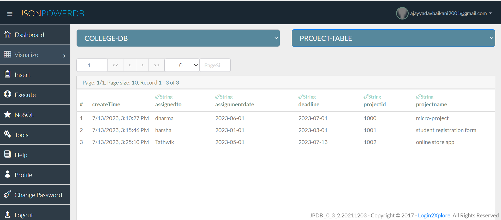

### [Title of the Project : ](#title-of-the-project)

## **[Project Management Form](#project-management-form)**   

I have selected Project Management Form as my Micro Project.  
### [Description](#description) 
Project Management Form that will store data in PROJECT-TABLE relation of COLLEGE-DB database.  
**Input Fields:** {Project-ID, Project-Name, Assigned-To, Assignment-Date, Deadline}  
**Primary key:** Project-ID.

### About JsonPowerDB:

- JsonPowerDB is a Real-time, High Performance, Lightweight and Simple to Use, Rest API based Multi-mode DBMS. JsonPowerDB has ready to use API for Json document DB, RDBMS, Key-value DB, GeoSpatial DB and Time Series DB functionality. JPDB supports and advocates for true serverless and pluggable API development.

### [Benefits of using JsonPowerDB](#benefits-of-using-jsonpowerdb)

- Simplest way to retrieve data in a JSON format.
- Schema-free, Simple to use, Nimble and In-Memory database.
- It is built on top of one of the fastest and real-time data indexing engine - PowerIndeX.
- It is low level (raw) form of data and is also human readable.
- It helps developers in faster coding, in-turn reduces development cost.    
Read more about JsonPowerDB at [Documentation Link](http://login2explore.com/jpdb/docs.html)

### Release History

Uploaded index.html and index.js along with Readme.

## [Screenshots](#screenshots)
Index Page

Saving a new data

Updating a data

JPDB Database

## About

This Project uses Ajax and Jquery to communicate with the data along with the script provided by the jpdb-commons and Bootstrap for styling.  

Most of the results and outputs are printed in the Console. Make sure you check the Console.

## Scope of functionalities

JSON-powered databases is quite broad and can be applied to various scenarios and industries like Web and Mobile Applications, Content Management Systems, Online Examination Registration, Job Application, Schools, Hospitals etc.

## Project status : 
Finished ✅

### Additional Information
Ajay Yadav.  
Mail to : ajayyadavbaikani2001@gmail.com
